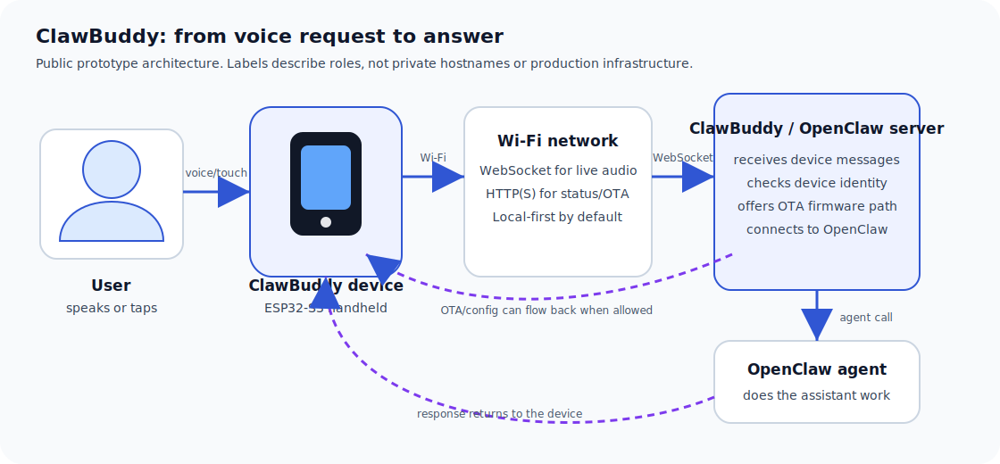
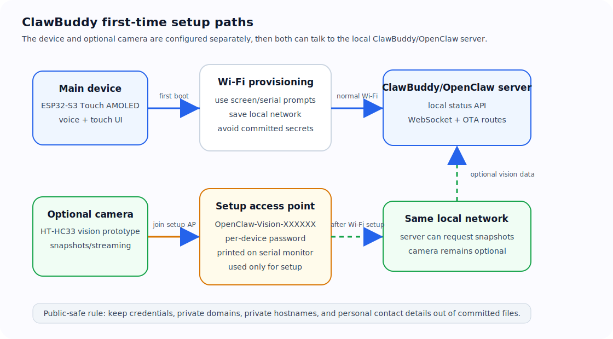
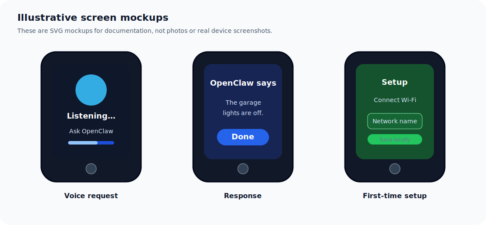
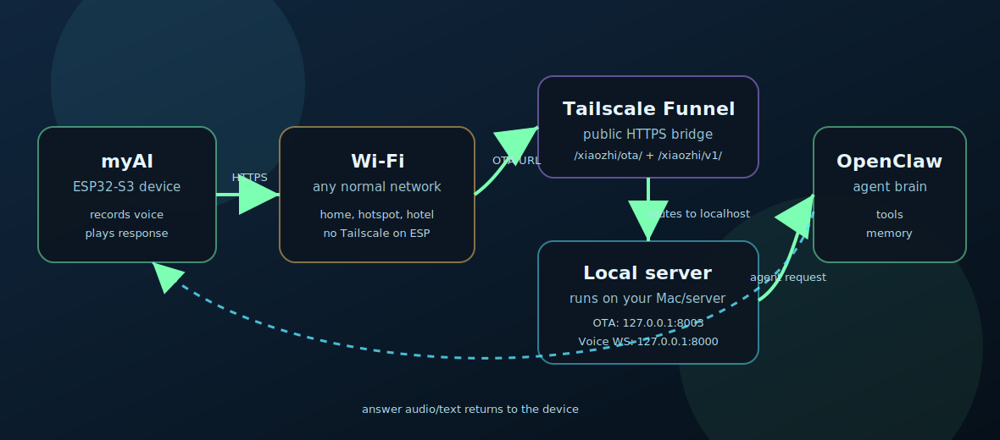

<p align="center">
  
</p>

<p align="center">
  <a href="docs/branding/README.md"></a>
  
  
  
</p>

# ClawBuddy

**Your OpenClaw companion, always within reach.**

ClawBuddy is a small handheld voice device for reaching your OpenClaw agent without opening a laptop or phone. Press, talk naturally, and let the ESP32-S3 prototype send your request over Wi‑Fi to a ClawBuddy/OpenClaw server; the answer comes back to the device.

This repo is the public-safe prototype workspace: firmware, local tools, setup docs, diagrams, and the [ClawBuddy brand kit](docs/branding/README.md) in one place. It is meant to be understandable, flashable, and safe to experiment with, but it is not a finished consumer product yet.

## What it does today

- Provides prototype firmware for the **Waveshare ESP32-S3 Touch AMOLED 1.8**.
- Provides a small local ClawBuddy CLI and status server.
- Keeps ClawBuddy development separate from any production OpenClaw voice bridge.
- Documents the planned device → server → OpenClaw flow, OTA updates, and optional vision camera setup.
- Includes a lightweight public-safe [brand kit and logo assets](docs/branding/README.md) for docs, ads, and launch materials.

## How the pieces fit together



Short version:

1. You talk to the ClawBuddy device.
2. The device connects over Wi‑Fi.
3. Audio/control messages go to the ClawBuddy/OpenClaw server over WebSocket.
4. The server talks to an OpenClaw agent.
5. The answer is sent back to the device.
6. Optional OTA updates let the device safely receive newer firmware.

Optional camera and first-time setup paths:



Illustrative device screens:



These are documentation mockups, not real device photos or captured screenshots.

## What you need

### For the fastest non-hardware check

You only need:

- A Mac or Linux computer.
- `git`.
- Python 3.
- This repository.

This path checks the local ClawBuddy tools. It does **not** flash a device.

### For firmware building/flashing

You also need:

- A **Waveshare ESP32-S3 Touch AMOLED 1.8** device.
- A USB cable that supports data, not just charging.
- ESP-IDF for ESP32-S3 builds.
- A serial port name for your device, such as `/dev/cu.usbmodemXXXX` on macOS or `/dev/ttyACM0` on Linux.

### Optional

- An HT-HC33 vision camera prototype if you want image/snapshot experiments.
- A local OpenClaw setup if you want to connect the device to a real agent.

## Fastest path: check the prototype tools

Copy/paste:

```bash
git clone https://github.com/Homard-Simpson/clawbuddy.git clawbuddy && cd clawbuddy && make test
```

What this does:

- `git clone https://github.com/Homard-Simpson/clawbuddy.git clawbuddy` downloads this repo into a folder named `clawbuddy`.
- `cd clawbuddy` moves your terminal into that folder.
- `make test` checks that the local Python tools can run and produce valid JSON.

If this passes, your clone is healthy enough to explore.

## Try the local commands

Run these from the repo root:

```bash
make status
make profiles
bin/clawbuddy tune forgiving
make test
```

What each command does:

- `make status` prints the local ClawBuddy configuration and checks that planned prototype ports are free.
- `make profiles` lists voice-input tuning presets.
- `bin/clawbuddy tune forgiving` chooses a more patient listening preset for softer voices or longer pauses. It edits ClawBuddy’s local runtime config only.
- `make test` runs the lightweight repo checks.

Other useful commands:

```bash
make live
bin/clawbuddy init
```

What these do:

- `make live` does a read-only comparison against a running prototype bridge, if one exists. It should not change the bridge.
- `bin/clawbuddy init` creates a local runtime config from the example config if one is missing.

You can also run the local status API:

```bash
bin/clawbuddy-server
```

Then, in another terminal:

```bash
curl http://127.0.0.1:8199/health
curl http://127.0.0.1:8199/status
curl http://127.0.0.1:8199/profiles
```

What this does:

- `bin/clawbuddy-server` starts a local-only HTTP status server.
- `/health` returns a simple “is the server alive?” response.
- `/status` returns ClawBuddy status as JSON.
- `/profiles` returns the available voice tuning profiles as JSON.

The server binds to `127.0.0.1` by default, so it is only reachable from your own computer.

## Pair a device (simple prototype flow)

A ClawBuddy device is **unpaired** until its public identity is approved by the server allowlist. Unpaired devices get `403 forbidden` from OTA and do not receive websocket/server settings. A **paired** device has both values approved:

- `device-id`: the device Wi-Fi MAC address, for example `aa:bb:cc:dd:ee:ff`
- `client-id`: the firmware UUID, for example `00000000-0000-4000-8000-000000000000`

These are identifiers, not passwords. Do not publish real ones in issues or docs.

### Easiest local pairing page

Run this on the Mac/Linux machine that owns the ClawBuddy server config:

```bash
bin/clawbuddy-server
```

Open:

```text
http://127.0.0.1:8199/pair
```

Paste the device-id and client-id, add an optional label, then click **Approve device**. The page is bound to `127.0.0.1` only; do not expose it through Tailscale Funnel.

The pairing helper writes:

```text
config/device-allowlist.local.json
```

That local file is git-ignored. If your server does not read that file directly yet, copy the YAML shown on the page into your server config under `server.auth`.

### CLI pairing

You can do the same thing without a browser:

```bash
bin/clawbuddy pair add aa:bb:cc:dd:ee:ff 00000000-0000-4000-8000-000000000000 --label "desk prototype"
bin/clawbuddy pair list
bin/clawbuddy pair snippet
```

- `pair add` approves the device locally.
- `pair list` shows approved and pending records.
- `pair snippet` prints the exact `server.auth.allowed_devices` / `allowed_clients` YAML to paste into a compatible server config.

### Where to find the IDs

Try these in order:

1. On current firmware, open the setup portal at `http://192.168.4.1`, go to **Advanced**, and copy **Device identity for pairing**.
2. With USB attached, watch the serial monitor while the device boots or calls OTA. The firmware logs a `UUID=...`; the OTA request uses headers `Device-Id` and `Client-Id`.
3. If OTA reaches the server but is rejected, check the OTA rejection/403 logs. They should include the attempted device-id/client-id pair.
4. Fallback: `device-id` is the Wi-Fi STA MAC address; `client-id` is the board UUID stored in device NVS and may change if NVS is erased.

## Full setup: build and flash firmware

### 1. Install ESP-IDF

If you already have ESP-IDF installed, skip to step 2.

```bash
git clone --recursive https://github.com/espressif/esp-idf.git ~/.espressif/v6.0/esp-idf
~/.espressif/v6.0/esp-idf/install.sh esp32s3
source ~/.espressif/v6.0/esp-idf/export.sh
```

What this does:

- Downloads Espressif’s official build tools.
- Installs support for the ESP32-S3 chip.
- Adds the ESP-IDF tools to your current terminal session.

### 2. Build ClawBuddy firmware

```bash
cd clawbuddy/firmware/clawbuddy
./build-clawbuddy.sh
```

What this does:

- Enters the firmware folder.
- Runs the ClawBuddy build wrapper.
- Produces firmware files under the firmware build directory.

If ESP-IDF is installed somewhere else:

```bash
IDF_EXPORT=/path/to/esp-idf/export.sh ./build-clawbuddy.sh
```

### 3. Flash the device

Plug in the ESP32-S3 device, then run:

```bash
source ~/.espressif/v6.0/esp-idf/export.sh
idf.py -p /dev/cu.usbmodemXXXX flash monitor
```

Replace `/dev/cu.usbmodemXXXX` with your actual device port.

What this does:

- Loads ESP-IDF into your terminal.
- Writes the firmware to the device.
- Opens the serial monitor so you can see setup messages.

On Linux your port may look like `/dev/ttyACM0` or `/dev/ttyUSB0`.

## First boot and setup

After flashing:

1. Keep the device connected by USB.
2. Watch the screen and serial monitor for Wi‑Fi/setup instructions.
3. Connect the device to your Wi‑Fi using the prompts provided by the firmware.
4. Point it at your ClawBuddy/OpenClaw server when that runtime is ready.

For public prototypes, avoid putting secrets, personal hostnames, or private network names in committed files.

## Make it work anywhere with Tailscale

If you want ClawBuddy to work outside your home network, use Tailscale Funnel/Serve on the Mac or server that runs OpenClaw.

Plain English:

- ClawBuddy joins any normal Wi‑Fi network.
- Your Mac/server stays on Tailscale.
- Tailscale gives the server an HTTPS address.
- ClawBuddy calls that HTTPS OTA URL, then receives the websocket/server details from OTA.
- Unpaired devices are rejected by the OTA allowlist, so a public Funnel URL does not mean public access to Claw/OpenClaw.



Read the full guide: [`docs/TAILSCALE_SETUP.md`](docs/TAILSCALE_SETUP.md).

Security model in one sentence: **Tailscale Funnel makes the ClawBuddy doorway reachable, but only paired/approved devices get the keys.**

During OTA, the device sends `device-id` and `client-id`; the server checks those against its allowlist. Unknown devices get `403 forbidden` and do not receive firmware download access or websocket/server config.

The OTA URL to build into firmware looks like this:

```text
https://<your-tailnet-host>:<https-port>/xiaozhi/ota/
```

For normal setup, enter that URL on the device setup page:

1. Join the temporary `ClawBuddy-XXXX` Wi‑Fi setup network.
2. Open the captive portal or `http://192.168.4.1`.
3. On **Advanced**, set **Custom OTA URL** to your Tailscale Funnel HTTPS URL, for example `https://your-clawbuddy-host.example.com/clawbuddy/ota/`.
4. Leave it blank to use the firmware build default.

The optional **Voice server WebSocket URL** field is only for manual overrides; normally the OTA response supplies websocket/server details. Compatibility routes such as `/xiaozhi/ota/` and `/xiaozhi/v1/` may still be used by the server while firmware/server protocol compatibility is maintained.

## Optional HT-HC33 vision camera

The camera prototype is separate from the main ClawBuddy device.

Typical first-time setup:

1. Flash the HT-HC33 camera firmware from `camera/ht_hc33_openclaw_vision/`.
2. On first boot, the camera creates a setup Wi‑Fi network named like `OpenClaw-Vision-XXXXXX`.
3. The per-device setup password is printed on the serial monitor.
4. Join that setup network and follow the captive portal to add your normal Wi‑Fi.

Security note: shared development passwords are only for private bench testing. Public prototypes should use per-device setup credentials.

See `camera/README.md` for camera-specific notes.

## Troubleshooting

### `make test` fails with “python3: command not found”

Install Python 3, then try again.

- macOS: install Python from python.org or Homebrew.
- Linux: install your distribution’s Python 3 package.

### `make status` says a port is not free

Another program is already using one of ClawBuddy’s planned local ports.

Close the other program or change the ClawBuddy runtime config. The default prototype ports are documented in `ops/RUNTIME_PORTS_AND_LABELS.md`.

### `idf.py` is not found

ESP-IDF is not loaded in this terminal. Run:

```bash
source ~/.espressif/v6.0/esp-idf/export.sh
```

Then try the build or flash command again.

### The device port does not exist

Check:

- The USB cable supports data.
- The device is powered on.
- You used the right serial port.
- On Linux, your user may need permission to access serial devices.

### Flashing starts but fails

Try:

- Unplug and reconnect the device.
- Hold the device BOOT button while starting the flash command, then release it once flashing begins.
- Use a shorter or higher-quality USB cable.

### The device cannot join Wi‑Fi

Check:

- The Wi‑Fi name and password are correct.
- The network allows 2.4 GHz devices.
- The device is close enough to the access point.
- Your network does not require a web login page.

### The local status API does not answer

Make sure the server is running:

```bash
bin/clawbuddy-server
```

Then try from another terminal:

```bash
curl http://127.0.0.1:8199/health
```

### The camera setup network does not appear

Check the camera serial monitor. The setup network name and password are printed there. If the camera was already configured before, it may have joined a saved Wi‑Fi network instead of starting setup mode.

## Repo layout

- `bin/` — local ClawBuddy CLI and status server prototypes.
- `config/` — runtime config and voice tuning profiles.
- `firmware/clawbuddy/` — ClawBuddy firmware for the target ESP32-S3 device.
- `camera/` — optional camera prototypes.
- `hardware/` — target board notes.
- `bridge/` — future standalone ClawBuddy server/bridge code.
- `ops/` — security, ports, status contracts, and operational notes.
- `docs/` — demos, handoff notes, diagrams, and the [ClawBuddy brand kit](docs/branding/README.md).

## Safety and privacy notes

Before publishing, flashing, or field testing, read `SECURITY.md`.

Important defaults for public prototypes:

- Keep dashboards and admin routes private unless intentionally exposed.
- Use allowlisted devices where possible.
- Use signed or expiring URLs for firmware downloads.
- Do not commit secrets, tokens, personal domains, private hostnames, private IP plans, or personal contact details.
- Keep ClawBuddy development isolated from any production voice bridge until migration is deliberate and tested.

## License and attribution

- Root license and notice files: `LICENSE` and `NOTICE.md`.
- Inherited firmware attribution: `firmware/clawbuddy/UPSTREAM.md`.
- The optional `camera/ESP_HaLow/` third-party checkout is not vendored; install it separately only if needed.
